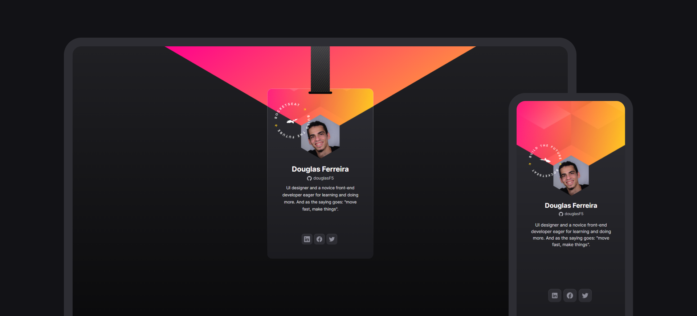

# Virtual badge (Crachá virtual)

In this exercise, the layout of a virtual badge was developed using **HTML** and **CSS** for structuring the page, **vanilla JavaScript** and **GitHub's REST API** for manipulating and adding data, and finally, **GitHub pages** for publishing it online - [you can check it out here](https://douglasf5.github.io/virtual-badge-nlw-heat-origin/).

**pt-br**

Nesse exercício, foi desenvolvido o layout de um crachá virtual usando **HTML** e **CSS** para a estrutura da página, **JavaScript vanilla** e a **REST API do GitHub** para manipulação e adição dos dados, e finalmente, **GitHub pages** para publicar a página na internet - [veja a página online](https://douglasf5.github.io/virtual-badge-nlw-heat-origin/).

